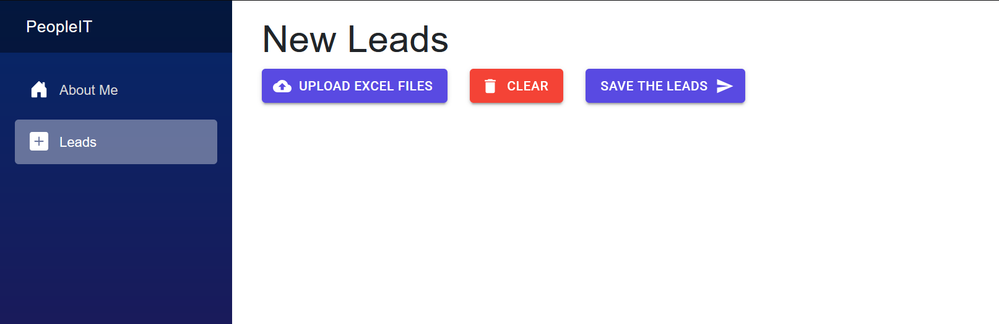

# PeopleIT Project



## Overview

This is a Blazor Server application called PeopleIT, designed to manage and import lead data. The primary functionality involves uploading Excel files containing lead information and adding them to a database. The application is built using .NET, Blazor, and leverages the ClosedXML library for Excel file parsing.

## Technologies Used

*   **.NET:** The core framework for the application.
*   **Blazor:**  A web framework that lets you build interactive client-side web UI with C#
*   **C#:** Programming language used for the application logic.
*   **ClosedXML:** Library for reading and writing Excel files.
*   **MudBlazor:** Component library for Blazor.

## Getting Started

### Prerequisites

*   **.NET SDK:**  Make sure you have the latest .NET SDK installed. You can download it from [https://dotnet.microsoft.com/download](https://dotnet.microsoft.com/download).
*   **IDE:**  Visual Studio, Visual Studio Code, or Rider are recommended.

### Setup

1.  **Clone the Repository:**
    ```bash
    git clone https://github.com/Vnitjain/peopleit.git
    ```

2.  **Restore NuGet Packages:**
    Open the solution file (`PeopleIT.sln`) in your IDE and restore the NuGet packages.

3.  **Database Configuration:**

    *   The application currently uses PeopleITDBContext. You'll need to configure the connection string to your database.  The connection string is likely located in `appsettings.json` or a similar configuration file.
    *   Make sure the database exists and the PeopleITDBContext can connect successfully.

4.  **Run the Application:**
    Build and run the application from your IDE. The application will typically be accessible at `https://localhost:3000`.


## Database Connection Details

The application relies on a properly configured database connection. Here's a summary:

*   **Database Context:** `PeopleITDBContext`
*   **Configuration File:** `appsettings.json` (typically)
*   **Connection String Key:**  `ConnectionStrings:PeopleITDB`
*   **Example Connection String:**

```json
"ConnectionStrings": {
  "PeopleITDB": "Server=your_server;Database=your_database;User Id=your_user;Password=your_password;"
}
```

### Key Components

*   **`PeopleIT/Components/Pages/Counter.razor`:**  A simple counter component, likely used for demonstration purposes.
*   **`PeopleIT/Components/Pages/Error.razor`:**  Displays error information, including a request ID and development mode details.
*   **`PeopleIT/Components/Pages/Leads.razor`:**  The primary component for lead management.  It handles file uploads, displays a list of selected files, and provides a "Save" button.
*   **`PeopleIT/Data/PeopleITDBContext.cs`**:  The database context class responsible for interacting with the database.
*   **`PeopleIT/Data/Models/Lead.cs`**:  Model class representing a Lead record.

## Usage

1.  **Upload Excel File:** Use the "MudFileUpload" control to upload an Excel file containing lead data.  Ensure the file is in the expected format (.xlsx).
2.  **Review Files:** The uploaded file(s) are displayed in a list with their names and sizes.
3.  **Save Leads:** Click the "Save the leads" button to import the data from the uploaded Excel file(s) into the database.

## Code Structure

<place image here: Project Directory Structure Diagram>

The project follows a standard Blazor project structure.

*   `PeopleIT.csproj`:  Main project file.
*   `PeopleIT/Pages`:  Contains the Blazor page components.
*   `PeopleIT/Data`:  Contains data access and model classes.
*   `PeopleIT/wwwroot`: Contains static assets like CSS, JavaScript, and images.

